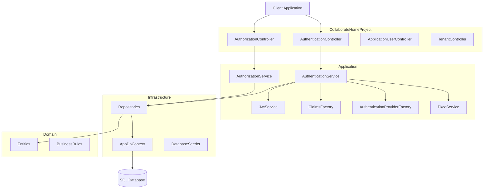

```mermaid
flowchart TB

    Client["Client Application"]

    subgraph API["CollaborateHomeProject"]
        AuthenticationController
        AuthorizationController
        ApplicationUserController
        TenantController
    end

    subgraph Application
        AuthenticationService
        AuthorizationService
        JwtService
        ClaimsFactory
        AuthenticationProviderFactory
        PkceService
    end

    subgraph Infrastructure
        Repositories
        AppDbContext
        DatabaseSeeder
    end

    subgraph Domain
        Entities
        BusinessRules
    end

    Database[(SQL Database)]

    Client --> AuthenticationController
    Client --> AuthorizationController

    AuthenticationController --> AuthenticationService

    AuthorizationController --> AuthorizationService

    AuthenticationService --> AuthenticationProviderFactory
    AuthenticationService --> JwtService
    AuthenticationService --> ClaimsFactory
    AuthenticationService --> PkceService

    AuthenticationService --> Repositories
    AuthorizationService --> Repositories

    Repositories --> AppDbContext
    AppDbContext --> Database

    Repositories --> Entities
```
